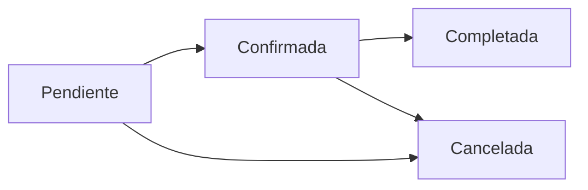

<div align="center">

# 🏨 Sistema de Gestión Hotelera Premium

[](https://dotnet.microsoft.com/)
[](https://asp.net/)
[](LICENSE)
[](https://docs.microsoft.com/en-us/dotnet/csharp/)

**Sistema web completo para la gestión integral de hoteles**
*Desarrollado con ASP.NET Core MVC siguiendo las mejores prácticas de desarrollo*

[🚀 Inicio Rápido](#-inicio-rápido) • [📖 Documentación](#-tabla-de-contenidos) • [✨ Características](#-características-principales) • [🤝 Contribuir](#-contribución)

---

</div>

## 📋 Tabla de Contenidos

- [Descripción General](#-descripción-general)
- [Características Principales](#-características-principales)
- [Tecnologías y Arquitectura](#️-tecnologías-y-arquitectura)
- [Requisitos del Sistema](#-requisitos-del-sistema)
- [Inicio Rápido](#-inicio-rápido)
- [Estructura del Proyecto](#-estructura-del-proyecto)
- [Módulos del Sistema](#-módulos-del-sistema)
- [Configuración Avanzada](#️-configuración-avanzada)
- [Validaciones y Seguridad](#-validaciones-y-seguridad)
- [API y Endpoints](#-api-y-endpoints)
- [Scripts de Despliegue](#-scripts-de-despliegue)
- [Testing](#-testing)
- [Contribución](#-contribución)
- [Licencia](#-licencia)
- [Soporte](#-soporte)

---

## 🎯 Descripción General

**Hotel Premium Management System** es una solución web empresarial desarrollada en ASP.NET Core MVC que automatiza y optimiza todos los procesos operativos de un hotel moderno. Diseñado con arquitectura MVC, implementa patrones de diseño avanzados y mejores prácticas de desarrollo.

### 🎪 ¿Por qué este sistema?

- ✅ **Gestión Integral**: Administra clientes, huéspedes, habitaciones, reservas y facturación
- ✅ **Tiempo Real**: Actualizaciones instantáneas de disponibilidad usando AJAX
- ✅ **Escalable**: Arquitectura modular lista para crecimiento
- ✅ **Profesional**: Logging, validaciones y manejo de errores robusto
- ✅ **Fácil de Usar**: Interfaz intuitiva y responsiva

---

## ✨ Características Principales

<table>
<tr>
<td width="50%">

### 👥 Gestión de Clientes
- ✔️ CRUD completo con validaciones
- ✔️ Tipos: VIP, Frecuente, Corporativo, Regular, Premium
- ✔️ Importación masiva desde archivos
- ✔️ Historial de reservas por cliente
- ✔️ Búsqueda y filtros avanzados

### 🛏️ Gestión de Habitaciones
- ✔️ **30 Sencillas** - Pisos 2-4 ($200.000/noche)
- ✔️ **10 Ejecutivas** - Piso 5 ($350.000/noche + minibar)
- ✔️ **5 Suites** - Piso 6 ($500.000/noche + minibar premium)
- ✔️ Estados en tiempo real: Disponible, Ocupada, Reservada
- ✔️ Visualización por piso y tipo

### 📅 Sistema de Reservas Inteligente
- ✔️ Reservas desde HOY con validación correcta
- ✔️ Múltiples habitaciones por reserva
- ✔️ Asignación de huéspedes
- ✔️ **Cancelación con política de 24 horas**
- ✔️ Cálculo automático de precios
- ✔️ Estados: Pendiente → Confirmada → Completada/Cancelada

</td>
<td width="50%">

### 🌍 Gestión de Huéspedes
- ✔️ Registro nacional e internacional
- ✔️ **56 huéspedes precargados** de 15 nacionalidades
- ✔️ Validación automática de IVA por nacionalidad
- ✔️ Documentos: CC, CE, Pasaporte, TI
- ✔️ Importación masiva desde archivos

### 🧾 Recepción y Facturación
- ✔️ Check-in/Check-out ágil
- ✔️ Facturación automática con:
  - Precio base por noche
  - Seguro hotelero (2.5%)
  - **IVA (19% solo colombianos)**
  - Consumos de minibar
- ✔️ Múltiples métodos de pago
- ✔️ Historial completo de facturas

### 🍹 Minibar con AJAX
- ✔️ **Registro sin recarga de página**
- ✔️ Actualización de stock en tiempo real
- ✔️ Control de inventario automático
- ✔️ Cálculo instantáneo de consumos
- ✔️ Productos por tipo de habitación

### 📊 Auditoría y Reportes
- ✔️ Registro de todas las operaciones
- ✔️ Trazabilidad completa
- ✔️ Logging profesional con ILogger
- ✔️ Notificaciones del sistema

</td>
</tr>
</table>

---

## 🛠️ Tecnologías y Arquitectura

### Stack Tecnológico

```
┌─────────────────────────────────────────────────────────────┐
│                    Frontend Layer                           │
├─────────────────────────────────────────────────────────────┤
│  Bootstrap 5  │  jQuery  │  JavaScript ES6  │  Razor Views │
└─────────────────────────────────────────────────────────────┘
                            ↓
┌─────────────────────────────────────────────────────────────┐
│                    Presentation Layer                       │
├─────────────────────────────────────────────────────────────┤
│             ASP.NET Core MVC Controllers                    │
│  ClienteController │ HuespedController │ ReservaController │
└─────────────────────────────────────────────────────────────┘
                            ↓
┌─────────────────────────────────────────────────────────────┐
│                    Business Logic Layer                     │
├─────────────────────────────────────────────────────────────┤
│                      Services Layer                         │
│  ClienteService │ HuespedService │ ReservaService │ etc.   │
└─────────────────────────────────────────────────────────────┘
                            ↓
┌─────────────────────────────────────────────────────────────┐
│                    Data Access Layer                        │
├─────────────────────────────────────────────────────────────┤
│          In-Memory Collections (Singleton Pattern)          │
│         File System (Import/Export .txt files)              │
└─────────────────────────────────────────────────────────────┘
```

### Tecnologías Clave

| Tecnología | Versión | Propósito |
|-----------|---------|-----------|
| **.NET** | 9.0 | Framework principal |
| **ASP.NET Core MVC** | 9.0 | Arquitectura web |
| **C#** | 12.0 | Lenguaje de programación |
| **Bootstrap** | 5.3 | Framework CSS responsivo |
| **jQuery** | 3.7 | Manipulación del DOM |
| **Font Awesome** | 6.0 | Iconografía |
| **LINQ** | - | Consultas a colecciones |
| **ILogger** | - | Logging profesional |
| **Dependency Injection** | - | Inyección de dependencias |

### Patrones de Diseño Implementados

- 🎨 **MVC (Model-View-Controller)** - Separación de responsabilidades
- 🔧 **Service Layer Pattern** - Lógica de negocio encapsulada
- 💉 **Dependency Injection** - Acoplamiento bajo
- 🔄 **Repository Pattern** - Abstracción de acceso a datos
- 📦 **Singleton Pattern** - Servicios como instancias únicas
- 🎭 **Factory Pattern** - Creación de objetos complejos
- 📝 **Observer Pattern** - Sistema de auditoría

---

## 📦 Requisitos del Sistema

### Software Necesario

```bash
# Obligatorios
✅ .NET 9.0 SDK o superior
✅ Git 2.30+
✅ Navegador moderno (Chrome 90+, Firefox 88+, Edge 90+)

# Opcionales (Recomendados)
⭐ Visual Studio 2022 17.8+ (Community, Professional o Enterprise)
⭐ Visual Studio Code 1.80+ con extensión C#
⭐ Windows Terminal (para mejor experiencia CLI)
```

### Sistemas Operativos Compatibles

- ✅ **Windows** 10/11 (x64)
- ✅ **Linux** (Ubuntu 20.04+, Debian 11+, Fedora 36+)
- ✅ **macOS** 11+ (Big Sur o superior)

### Requisitos de Hardware

| Componente | Mínimo | Recomendado |
|-----------|---------|-------------|
| **CPU** | 2 cores | 4+ cores |
| **RAM** | 4 GB | 8+ GB |
| **Disco** | 2 GB libre | 5+ GB libre |
| **Red** | Conexión estable | - |

---

## 🚀 Inicio Rápido

### Opción 1: Instalación Estándar (5 minutos)

```bash
# 1️⃣ Clonar el repositorio
git clone https://github.com/SanTacrZ/hotel_MVC_ASP.NET.git
cd hotel_MVC_ASP.NET

# 2️⃣ Restaurar dependencias
dotnet restore

# 3️⃣ Compilar el proyecto
dotnet build

# 4️⃣ Ejecutar la aplicación
dotnet run

# ✅ Abrir en el navegador
# http://localhost:5000
```

### Opción 2: Con Visual Studio

1. Abrir `hotel_web_final.sln`
2. Presionar `F5` o click en ▶️ Run
3. La aplicación se abrirá automáticamente

### Opción 3: Usando Scripts de Despliegue

```bash
# Ver sección "Scripts de Despliegue" más abajo
./deploy-to-github.sh
```

### 🎉 ¡Primera Ejecución Exitosa!

Si ves esto, estás listo:

```
info: Microsoft.Hosting.Lifetime[14]
      Now listening on: http://localhost:5000
info: Microsoft.Hosting.Lifetime[14]
      Now listening on: https://localhost:5001
info: Microsoft.Hosting.Lifetime[0]
      Application started. Press Ctrl+C to shut down.
```

**Credenciales de Prueba:**
- Usuario: `admin`
- Contraseña: `admin123`

---

## 📁 Estructura del Proyecto

```
hotel_web_final/
│
├── 📂 Controllers/              # 🎮 Controladores MVC
│   ├── AuthController.cs        # Autenticación
│   ├── ClienteController.cs     # Gestión de clientes
│   ├── HuespedController.cs     # Gestión de huéspedes
│   ├── HabitacionController.cs  # Gestión de habitaciones
│   ├── ReservaController.cs     # Sistema de reservas
│   ├── RecepcionController.cs   # Check-in/Check-out
│   ├── AuditoriaController.cs   # Logs del sistema
│   └── HomeController.cs        # Página principal
│
├── 📂 Views/                    # 🎨 Vistas Razor (.cshtml)
│   ├── Auth/                    # Login/Logout
│   ├── Cliente/                 # CRUD Clientes
│   ├── Huesped/                 # CRUD Huéspedes
│   ├── Habitacion/              # Gestión habitaciones
│   ├── Reserva/                 # Sistema de reservas
│   ├── Recepcion/               # Check-in/out, Facturas
│   ├── Auditoria/               # Logs y reportes
│   ├── Home/                    # Dashboard
│   └── Shared/                  # Layout, parciales
│       ├── _Layout.cshtml       # Layout principal
│       └── _ValidationScriptsPartial.cshtml
│
├── 📂 Servicios/                # 💼 Lógica de Negocio
│   ├── AuthService.cs           # Autenticación
│   ├── ClienteService.cs        # Lógica clientes
│   ├── HuespedService.cs        # Lógica huéspedes
│   ├── HabitacionService.cs     # Lógica habitaciones
│   ├── ReservaService.cs        # Lógica reservas
│   ├── RecepcionService.cs      # Check-in/out
│   ├── HotelService.cs          # Configuración hotel
│   ├── MinibarService.cs        # Gestión minibar
│   ├── NotificacionService.cs   # Notificaciones
│   ├── AuditoriaService.cs      # Registro auditoría
│   └── ValidacionService.cs     # Validaciones centralizadas
│
├── 📂 Filters/                  # 🔒 Filtros y Middleware
│   └── AuthorizationFilter.cs   # Control de acceso
│
├── 📂 wwwroot/                  # 🌐 Archivos Estáticos
│   ├── css/
│   │   └── site.css             # Estilos personalizados
│   ├── js/
│   │   └── site.js              # JavaScript global
│   ├── lib/                     # Librerías frontend
│   │   ├── bootstrap/           # Bootstrap 5
│   │   ├── jquery/              # jQuery
│   │   └── jquery-validation/   # Validación
│   └── favicon.ico
│
├── 📂 Arhivos/                  # 📄 Datos de Importación
│   ├── Clientes.txt             # 5 clientes precargados
│   └── Huespedes.txt            # 56 huéspedes de 15 países
│
├── 📂 biblioteca_hotel/         # 📚 Biblioteca de Clases
│   ├── Clases/                  # Entidades del dominio
│   ├── Interfaces/              # Contratos
│   ├── Factories/               # Fábricas de objetos
│   ├── Aspectos/                # Programación orientada a aspectos
│   └── Eventos/                 # Sistema de eventos
│
├── 📜 Program.cs                # ⚙️ Configuración principal
├── 📜 appsettings.json          # 🔧 Configuración de la app
├── 📜 hotel_web_final.csproj    # 📦 Archivo del proyecto
│
├── 📜 deploy-to-github.sh       # 🚀 Script deploy (Bash)
├── 📜 deploy-to-github.ps1      # 🚀 Script deploy (PowerShell)
├── 📜 DEPLOY_INSTRUCTIONS.md    # 📖 Guía de despliegue
│
├── 📜 README.md                 # 📘 Este archivo
├── 📜 LICENSE                   # ⚖️ Licencia MIT
└── 📜 .gitignore                # 🚫 Archivos ignorados por Git
```

---

## 🎯 Módulos del Sistema

### 1. 👤 Módulo de Autenticación

**Características:**
- Login con validación de credenciales
- Gestión de sesiones seguras
- Control de acceso por roles
- Logout con limpieza de sesión

**Endpoints:**
- `GET /Auth/Login` - Formulario de login
- `POST /Auth/Login` - Autenticación
- `POST /Auth/Logout` - Cerrar sesión

---

### 2. 👥 Módulo de Clientes

**Características:**
- ✅ CRUD completo (Create, Read, Update, Delete)
- ✅ Validación de datos en cliente y servidor
- ✅ Importación masiva desde archivos .txt
- ✅ Búsqueda por documento
- ✅ Clasificación por tipo (VIP, Regular, Corporativo, etc.)

**Tipos de Cliente:**
| Tipo | Descripción | Beneficios |
|------|-------------|------------|
| **VIP** | Clientes premium | Descuentos especiales, prioridad |
| **Frecuente** | Visitas regulares | Programa de fidelización |
| **Corporativo** | Empresas | Facturación centralizada |
| **Premium** | Alto valor | Servicios exclusivos |
| **Regular** | Cliente estándar | Servicios básicos |

**Formato de Importación:**
```
TipoDoc|NumDoc|Nombre|Apellido|Telefono|Email|Tarjeta|TipoCliente|Preferencias
CC|1234567890|Juan|Pérez|3001234567|juan@email.com|4532123456789012|VIP|Vista al mar
```

---

### 3. 🌍 Módulo de Huéspedes

**Características:**
- ✅ Registro de huéspedes nacionales e internacionales
- ✅ **56 huéspedes precargados** de 15 nacionalidades
- ✅ Validación automática de IVA según nacionalidad
- ✅ Soporte para múltiples tipos de documento
- ✅ Importación masiva

**Nacionalidades Incluidas:**
```
🇨🇴 Colombia (10)    🇪🇸 España (4)      🇺🇸 USA (5)
🇦🇷 Argentina (3)    🇲🇽 México (3)      🇧🇷 Brasil (3)
🇨🇱 Chile (2)        🇵🇪 Perú (2)        🇫🇷 Francia (2)
🇩🇪 Alemania (2)     🇮🇹 Italia (2)      🇬🇧 UK (2)
🇨🇦 Canadá (2)       🇯🇵 Japón (2)       🇰🇷 Corea (2)
🇨🇳 China (2)        🇻🇪 Venezuela (2)   🇪🇨 Ecuador (2)
```

**Tipos de Documento:**
- **CC** - Cédula de Ciudadanía (Colombia)
- **CE** - Cédula de Extranjería
- **Pasaporte** - Documento internacional
- **TI** - Tarjeta de Identidad

**Formato de Importación:**
```
TipoDoc|NumDoc|Nombre|Apellido|Telefono|Nacionalidad|Email
Pasaporte|USA123456|Michael|Johnson|3245678901|Estadounidense|michael@email.com
```

---

### 4. 🛏️ Módulo de Habitaciones

**Inicialización Automática:**

```
Total: 45 Habitaciones
├── 30 Sencillas (Pisos 2-4)
├── 10 Ejecutivas (Piso 5)
└── 5 Suites (Piso 6)
```

**Tipos de Habitación:**

<table>
<tr>
<th>Tipo</th>
<th>Características</th>
<th>Precio/Noche</th>
<th>Extras</th>
</tr>
<tr>
<td><strong>🛏️ Sencilla</strong></td>
<td>
  • 1 cama individual<br>
  • Baño privado<br>
  • TV por cable<br>
  • WiFi<br>
  • Pisos 2, 3 y 4
</td>
<td><strong>$200,000</strong></td>
<td>-</td>
</tr>
<tr>
<td><strong>💼 Ejecutiva</strong></td>
<td>
  • 1 cama doble<br>
  • Baño privado<br>
  • TV Smart<br>
  • WiFi<br>
  • Escritorio de trabajo<br>
  • Piso 5
</td>
<td><strong>$350,000</strong></td>
<td>✅ Minibar básico</td>
</tr>
<tr>
<td><strong>👑 Suite</strong></td>
<td>
  • Cama King Size<br>
  • Baño con jacuzzi<br>
  • TV Smart 55"<br>
  • WiFi Premium<br>
  • Sala de estar<br>
  • Balcón privado<br>
  • Piso 6
</td>
<td><strong>$500,000</strong></td>
<td>✅ Minibar premium<br>✅ Room service</td>
</tr>
</table>

**Estados:**
- 🟢 **Disponible** - Lista para reservar
- 🔴 **Ocupada** - Huésped en habitación
- 🟡 **Reservada** - Reserva confirmada
- 🔧 **Mantenimiento** - Fuera de servicio

---

### 5. 📅 Módulo de Reservas

**Funcionalidades Avanzadas:**

#### ✅ Creación de Reservas
- Permite reservas **desde HOY**
- Selección múltiple de habitaciones
- Asignación de huéspedes
- Cálculo automático de precios
- Validación de disponibilidad

#### 🚫 Política de Cancelación
```
⏰ Cancelación permitida: ≥ 24 horas antes del check-in
❌ Cancelación bloqueada: < 24 horas antes del check-in

Ejemplo:
Check-in: 15/11/2025 14:00
Última cancelación: 14/11/2025 14:00
```

#### 📊 Estados de Reserva



**Cálculo de Precios:**
```python
# Fórmula
precio_total = sum(habitacion.precio * num_noches for habitacion in habitaciones)

# Ejemplo
2 Sencillas × $200,000 × 3 noches = $1,200,000
1 Suite × $500,000 × 3 noches = $1,500,000
─────────────────────────────────────────────
Total = $2,700,000
```

---

### 6. 🧾 Módulo de Recepción y Facturación

**Check-in:**
1. Buscar reserva por ID o cliente
2. Verificar documentos del huésped
3. Asignar habitación(es)
4. Generar llave de acceso
5. Registrar hora de entrada

**Check-out:**
1. Calcular total de estadía
2. Agregar consumos de minibar
3. Aplicar cargos adicionales
4. Calcular impuestos
5. Generar factura
6. Procesar pago
7. Liberar habitación

**Cálculo de Factura:**

```
━━━━━━━━━━━━━━━━━━━━━━━━━━━━━━━━━━━━━━━━━━━━
                  FACTURA HOTEL PREMIUM
━━━━━━━━━━━━━━━━━━━━━━━━━━━━━━━━━━━━━━━━━━━━
Cliente: Juan Pérez
Huésped: Juan Pérez (Colombiano)
Habitación: 301 - Suite
Check-in: 12/11/2025    Check-out: 15/11/2025
Noches: 3
━━━━━━━━━━━━━━━━━━━━━━━━━━━━━━━━━━━━━━━━━━━━
CONCEPTO                              VALOR
━━━━━━━━━━━━━━━━━━━━━━━━━━━━━━━━━━━━━━━━━━━━
Habitación (3 noches × $500,000)  $1,500,000
Consumos Minibar                      $50,000
                                 ───────────
Subtotal                          $1,550,000
Seguro Hotelero (2.5%)                $38,750
IVA (19%)                            $294,500
                                 ═══════════
TOTAL A PAGAR                     $1,883,250
━━━━━━━━━━━━━━━━━━━━━━━━━━━━━━━━━━━━━━━━━━━━
Método de Pago: Tarjeta de Crédito
¡Gracias por su visita! Vuelva pronto.
```

**Impuestos Aplicados:**
- **Seguro Hotelero:** 2.5% sobre subtotal (obligatorio)
- **IVA:** 19% solo para **huéspedes colombianos**

---

### 7. 🍹 Módulo de Minibar (AJAX)

**Características Innovadoras:**
- ✅ **Registro sin recarga de página** usando AJAX
- ✅ Actualización de stock en tiempo real
- ✅ Cálculo instantáneo de costo total
- ✅ Control de inventario automático
- ✅ Alertas visuales de bajo stock

**Productos Típicos:**

| Categoría | Productos | Precio |
|-----------|-----------|--------|
| **Bebidas** | Agua, Gaseosa, Jugo, Cerveza | $3,000 - $8,000 |
| **Snacks** | Papas, Chocolates, Galletas | $4,000 - $7,000 |
| **Licores** | Mini Whisky, Ron, Vodka | $15,000 - $25,000 |

**Interfaz del Usuario:**
```
┌────────────────────────────────────────────┐
│  MINIBAR - Habitación 301                  │
│  Costo Total: $45,000                      │
├────────────────────────────────────────────┤
│  🥤 Coca-Cola        $3,500   Stock: 4     │
│  [1] [Registrar] ←───────────────────────┐ │
│                                          │ │
│  🍫 Snickers         $5,000   Stock: 2   │ │
│  [1] [Registrar] ←─────────────────────┐ │ │
│                                        │ │ │
│  ✅ Registrado sin recargar página! ──┘ │ │
└────────────────────────────────────────────┘
```

**Tecnología:**
```javascript
// AJAX Request
fetch('/Recepcion/RegistrarConsumoAjax', {
    method: 'POST',
    body: formData
})
.then(response => response.json())
.then(data => {
    // Actualizar UI sin recargar
    actualizarStock(data.productos);
    actualizarTotal(data.costoTotal);
    mostrarNotificacion('✅ Producto registrado');
});
```

---

### 8. 📊 Módulo de Auditoría

**Eventos Registrados:**
- ✅ Creación/modificación de clientes
- ✅ Registro de huéspedes
- ✅ Creación/confirmación/cancelación de reservas
- ✅ Check-in y Check-out
- ✅ Generación de facturas
- ✅ Consumos de minibar
- ✅ Notificaciones enviadas
- ✅ Errores del sistema

**Formato de Log:**
```
[2025-11-12 23:30:15] INFO: Nueva reserva creada
  Usuario: admin
  Cliente: Juan Pérez
  Habitaciones: 301, 302
  Fecha entrada: 2025-11-15
  Fecha salida: 2025-11-18
  Total: $2,100,000
```

---

## ⚙️ Configuración Avanzada

### Archivo appsettings.json

```json
{
  "Logging": {
    "LogLevel": {
      "Default": "Information",
      "Microsoft.AspNetCore": "Warning"
    }
  },
  "AllowedHosts": "*",
  "Hotel": {
    "Nombre": "Hotel Premium",
    "Direccion": "Calle 123 #45-67",
    "Telefono": "3001234567",
    "Email": "info@hotelpremium.com",
    "SeguroHotelero": 2.5,
    "IVA": 19.0
  }
}
```

### Variables de Entorno

```bash
# Desarrollo
export ASPNETCORE_ENVIRONMENT=Development
export ASPNETCORE_URLS="http://localhost:5000;https://localhost:5001"

# Producción
export ASPNETCORE_ENVIRONMENT=Production
export ASPNETCORE_URLS="https://0.0.0.0:443"
```

### Configuración de HTTPS

```bash
# Generar certificado de desarrollo
dotnet dev-certs https --trust
```

---

## 🔒 Validaciones y Seguridad

### Validaciones del Cliente (JavaScript)

```javascript
✅ Nombres: Solo letras, sin números ni caracteres especiales
✅ Documentos: Máximo 10 dígitos, solo números
✅ Teléfonos: Exactamente 10 dígitos
✅ Emails: Formato válido (user@domain.com)
✅ Fechas: No permite fechas pasadas (usa DateTime.Today)
✅ Nacionalidad: Solo letras
```

### Validaciones del Servidor (C#)

```csharp
public class ValidacionService
{
    public static void ValidarNombre(string nombre, string campo)
    {
        if (string.IsNullOrWhiteSpace(nombre))
            throw new ArgumentException($"{campo} es requerido");

        if (nombre.Any(char.IsDigit))
            throw new ArgumentException($"{campo} no puede contener números");
    }

    public static void ValidarDocumento(string documento, string tipoDoc)
    {
        if (documento.Length > 10)
            throw new ArgumentException("Documento no puede tener más de 10 caracteres");

        if (!documento.All(char.IsDigit))
            throw new ArgumentException("Documento debe contener solo números");
    }

    // ... más validaciones
}
```

### Seguridad Implementada

- ✅ **Autenticación por sesiones** con HttpContext.Session
- ✅ **Autorización** mediante filtros personalizados
- ✅ **Validación de entrada** en cliente y servidor
- ✅ **Protección CSRF** con tokens anti-falsificación
- ✅ **Sanitización de datos** para prevenir XSS
- ✅ **Logging de auditoría** de todas las operaciones
- ✅ **Manejo seguro de excepciones** sin exponer detalles internos

---

## 🌐 API y Endpoints

### Endpoints Principales

#### Autenticación
```
POST   /Auth/Login                # Iniciar sesión
POST   /Auth/Logout               # Cerrar sesión
GET    /Auth/AccessDenied         # Acceso denegado
```

#### Clientes
```
GET    /Cliente                   # Listar todos
GET    /Cliente/Crear             # Formulario crear
POST   /Cliente/Crear             # Guardar nuevo
GET    /Cliente/Editar/{id}       # Formulario editar
POST   /Cliente/Editar/{id}       # Guardar cambios
POST   /Cliente/Eliminar/{id}     # Eliminar
```

#### Huéspedes
```
GET    /Huesped                   # Listar todos
GET    /Huesped/Crear             # Formulario crear
POST   /Huesped/Crear             # Guardar nuevo
GET    /Huesped/Editar/{id}       # Formulario editar
POST   /Huesped/Editar/{id}       # Guardar cambios
POST   /Huesped/Eliminar/{id}     # Eliminar
```

#### Habitaciones
```
GET    /Habitacion                # Listar todas
GET    /Habitacion/Disponibles    # Solo disponibles
GET    /Habitacion/PorTipo/{tipo} # Filtrar por tipo
GET    /Habitacion/Detalles/{id}  # Ver detalles
GET    /Habitacion/ReservarHabitacion/{id}  # Formulario reserva rápida
POST   /Habitacion/ReservarHabitacion       # Crear reserva
```

#### Reservas
```
GET    /Reserva                   # Listar todas
GET    /Reserva/Crear             # Formulario crear
POST   /Reserva/Crear             # Guardar nueva
GET    /Reserva/Detalles/{id}     # Ver detalles
POST   /Reserva/Confirmar/{id}    # Confirmar reserva
POST   /Reserva/Cancelar/{id}     # Cancelar (24h policy)
```

#### Recepción
```
GET    /Recepcion                         # Dashboard
GET    /Recepcion/CheckIn/{id}            # Check-in
POST   /Recepcion/CheckIn/{id}            # Procesar check-in
GET    /Recepcion/CheckOut/{id}           # Check-out
POST   /Recepcion/CheckOut/{id}           # Procesar check-out
GET    /Recepcion/VerFactura/{id}         # Ver factura
GET    /Recepcion/GestionarMinibar/{id}   # Minibar
POST   /Recepcion/RegistrarConsumoAjax    # AJAX - Registrar consumo
GET    /Recepcion/VerConsumos/{id}        # Ver consumos
```

#### Auditoría
```
GET    /Auditoria                 # Ver logs del sistema
```

---

## 🚀 Scripts de Despliegue

Este proyecto incluye **scripts automatizados** para facilitar el despliegue a GitHub.

### Scripts Disponibles

1. **`deploy-to-github.sh`** - Para Git Bash / Linux / Mac
2. **`deploy-to-github.ps1`** - Para Windows PowerShell

### Uso Rápido

```bash
# Git Bash / Linux / Mac
./deploy-to-github.sh

# PowerShell
.\deploy-to-github.ps1
```

### Características de los Scripts

✅ **Verificación automática** de repositorio y remote
✅ **Resumen visual** de archivos modificados
✅ **Confirmación interactiva** antes de proceder
✅ **Commit con mensaje profesional** predefinido
✅ **Manejo de errores** con rebase automático
✅ **Output colorido** fácil de leer
✅ **Resumen final** de lo que se subió

### Mensaje de Commit Generado

Los scripts crean automáticamente un commit con este formato:

```
feat: Implementar mejoras completas del sistema hotelero

✨ Nuevas Características:
- Permitir reservas desde HOY con validación correcta de fechas
- Implementar minibar con AJAX sin recarga de página
- Agregar validación de cancelación 24 horas antes del check-in
- Crear archivo Huespedes.txt con 56 huéspedes de 15 nacionalidades

🔧 Mejoras Técnicas:
- Reemplazar Console.WriteLine con logging profesional (ILogger)
- Corregir validaciones de fecha en frontend y backend
- Implementar endpoint AJAX para registro de consumos del minibar

🐛 Correcciones:
- Resolver problema de zona horaria en selección de fechas
- Normalizar fechas correctamente con .Date

📦 Archivos Agregados:
- Arhivos/Huespedes.txt (56 registros con diversas nacionalidades)

🤖 Generated with Claude Code
Co-Authored-By: Claude <noreply@anthropic.com>
```

Para más detalles, consulta **[DEPLOY_INSTRUCTIONS.md](DEPLOY_INSTRUCTIONS.md)**

---

## 🧪 Testing

### Ejecutar Tests

```bash
# Compilar y verificar
dotnet build

# Ejecutar en modo watch (auto-reload)
dotnet watch run
```

### Casos de Prueba Recomendados

#### ✅ Módulo de Reservas
- [ ] Crear reserva para HOY con check-out mañana
- [ ] Intentar cancelar reserva con < 24h (debe fallar)
- [ ] Cancelar reserva con > 24h (debe funcionar)
- [ ] Crear reserva con múltiples habitaciones
- [ ] Verificar cálculo correcto de precios

#### ✅ Módulo de Minibar
- [ ] Registrar consumo sin recargar página
- [ ] Verificar actualización de stock en tiempo real
- [ ] Agotar stock de un producto
- [ ] Verificar suma correcta de consumos

#### ✅ Módulo de Facturación
- [ ] Check-out de huésped colombiano (19% IVA)
- [ ] Check-out de huésped extranjero (0% IVA)
- [ ] Verificar cálculo de seguro hotelero (2.5%)
- [ ] Factura con consumos de minibar

---

## 🤝 Contribución

¡Las contribuciones son bienvenidas! Sigue estos pasos:

### 1️⃣ Fork del Proyecto

```bash
# Click en "Fork" en GitHub
# Luego clona tu fork
git clone https://github.com/TU_USUARIO/hotel_MVC_ASP.NET.git
```

### 2️⃣ Crear Rama para Feature

```bash
git checkout -b feature/NombreDelFeature
```

### 3️⃣ Hacer Cambios y Commit

```bash
git add .
git commit -m "feat: Agregar nueva funcionalidad X"
```

### 4️⃣ Push y Pull Request

```bash
git push origin feature/NombreDelFeature
```

Luego abre un Pull Request en GitHub.

### Convenciones de Código

- ✅ Usar **PascalCase** para clases y métodos
- ✅ Usar **camelCase** para variables locales
- ✅ Agregar **comentarios XML** en métodos públicos
- ✅ Seguir principios **SOLID**
- ✅ Escribir código **limpio y legible**

### Estilo de Commits

Usar [Conventional Commits](https://www.conventionalcommits.org/):

```
feat: Agregar nueva característica
fix: Corregir bug
docs: Actualizar documentación
style: Cambios de formato
refactor: Refactorizar código
test: Agregar tests
chore: Tareas de mantenimiento
```

---

## 📄 Licencia

Este proyecto está bajo la **Licencia MIT**.

```
MIT License

Copyright (c) 2025 SanTacrZ

Se concede permiso para usar, copiar, modificar y distribuir
este software con o sin modificaciones, sujeto a las condiciones
de la licencia MIT completa.

Ver LICENSE para más detalles.
```

---

## 💬 Soporte

### 📧 Contacto

- **GitHub**: [@SanTacrZ](https://github.com/SanTacrZ)
- **Email**: Disponible en el perfil de GitHub
- **Issues**: [Reportar un problema](https://github.com/SanTacrZ/hotel_MVC_ASP.NET/issues)

### 🐛 Reportar Bugs

Si encuentras un bug, por favor [abre un issue](https://github.com/SanTacrZ/hotel_MVC_ASP.NET/issues/new) con:

1. **Descripción** del problema
2. **Pasos para reproducir**
3. **Comportamiento esperado** vs **comportamiento actual**
4. **Capturas de pantalla** (si aplica)
5. **Versión** de .NET y sistema operativo

### 💡 Solicitar Features

¿Tienes una idea? [Abre un issue](https://github.com/SanTacrZ/hotel_MVC_ASP.NET/issues/new) con:

1. **Descripción** de la funcionalidad
2. **Caso de uso**
3. **Beneficios** esperados

---

## 🎖️ Créditos y Agradecimientos

### Desarrollado por
- **SanTacrZ** - Desarrollo completo del sistema

### Tecnologías de Terceros
- **Microsoft** - .NET Core y ASP.NET MVC
- **Bootstrap Team** - Framework CSS
- **jQuery Foundation** - Biblioteca JavaScript
- **Font Awesome** - Iconografía

### Herramientas Usadas
- **Visual Studio 2022** - IDE principal
- **Git & GitHub** - Control de versiones
- **Claude Code** - Asistencia en desarrollo

---

## 📊 Estadísticas del Proyecto

```
📈 Líneas de Código: ~10,000
📁 Archivos: 80+
👨‍💻 Contribuidores: 1
⭐ Estrellas: Dale una estrella si te gusta!
🍴 Forks: Bienvenidos
📝 Commits: 20+
🐛 Issues: 0 abiertos
```

---

## 🗺️ Roadmap

### Versión Actual: 1.0.0
✅ Sistema base funcional
✅ Gestión de clientes, huéspedes y habitaciones
✅ Sistema de reservas con política de 24h
✅ Minibar con AJAX
✅ Facturación automática

### Próximas Versiones

#### v1.1.0 (Planificado)
- [ ] Base de datos SQL Server
- [ ] API REST completa
- [ ] Dashboard con gráficos
- [ ] Exportar reportes a PDF/Excel

#### v1.2.0 (Futuro)
- [ ] Integración con pasarelas de pago
- [ ] Notificaciones por email/SMS
- [ ] Módulo de empleados
- [ ] Calendario de ocupación

#### v2.0.0 (Visión)
- [ ] Aplicación móvil
- [ ] Gestión multipropiedad
- [ ] Inteligencia artificial para predicción
- [ ] Sistema de fidelización avanzado

---

<div align="center">

## ⭐ Si este proyecto te fue útil, considera darle una estrella en GitHub!

[](https://github.com/SanTacrZ/hotel_MVC_ASP.NET)

---

**Hecho con ❤️ usando ASP.NET Core MVC**

*Hotel Premium Management System - 2025*

[🔝 Volver arriba](#-sistema-de-gestión-hotelera-premium)

</div>
